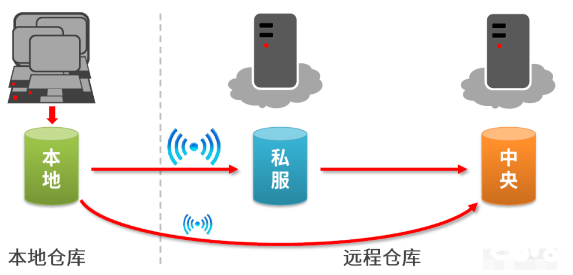

<p align="center">
    <a href="https://milvus.io/">
       
    </a>
</p>

# 测试框架使用说明

## 简介

基于TestNG编写的的针对**milvus-sdk-java**测试的的自动化测试框架。

## 快速开始

### 环境准备

-[安装java-sdk](https://www.oracle.com/java/technologies/downloads/)

-[安装maven](http://maven.apache.org/download.cgi)

### 启动 Milvus

- [安装 Milvus 单机版](https://milvus.io/cn/docs/v2.0.0/install_standalone-docker.md)

- [安装 Milvus 分布式版本](https://milvus.io/cn/docs/v2.0.0/install_cluster-docker.md)

### 引入MILVUS-SKD-JAVA

#### 仓库（maven）



#### 中央仓库

```xml

<dependency>
    <groupId>io.milvus</groupId>
    <artifactId>milvus-sdk-java</artifactId>
    <version>2.0.4</version>
</dependency>
```

#### 私库

- 仓库地址：http://10.13.0.84:9081/#browse/browse:nexus-snapshots:io

- 参考开发环境：https://zilliverse.feishu.cn/wiki/wikcnjtrUdSxgjcG3nLXe8C7bKf#

- 打开Maven安装目录下\conf文件，编辑settings.xml，在<services>标签下添加

```xml

<servers>
    <server>
        <id>nexus-releases</id>  <!--对应pom.xml的id=releases的仓库-->
        <username>admin</username>
        <password>admin123</password>
    </server>
    <server>
        <id>nexus-snapshots</id> <!--对应pom.xml中id=snapshots的仓库-->
        <username>admin</username>
        <password>admin123</password>
    </server>
</servers>
```

- 在pom文件中加入distributionManagement节点

```xml

<distributionManagement>
    <!--正式版本-->
    <repository>
        <!-- nexus服务器中用户名：在settings.xml中<server>的id-->
        <id>nexus-snapshots</id>
        <name>Snapshots repository</name>
        <url>http://10.13.0.84:9081/repository/nexus-snapshot/</url>
    </repository>
    <snapshotRepository>
        <id>nexus-snapshots</id>
        <name>Snapshots repository</name>
        <url>http://10.13.0.84:9081/repository/nexus-snapshot/</url>
    </snapshotRepository>
</distributionManagement>
```

- 修改milvus-sdk-java坐标version

```xml

<dependency>
    <groupId>io.milvus</groupId>
    <artifactId>milvus-sdk-java</artifactId>
    <version>2.0.5-SNAPSHOT</version>
</dependency>
```

## 模块介绍

### 文件结构

```ignorelang
.
├── allure-result  allure报告收集的运行结果集
├── log  日志目录
├── src
    ├──java    
        ├── aop  切面编程目录
        ├── common  项目静态资源
            ├── BaseTest  封装的基础测试类   
            └── Common*  封装的测试方法和数据
        ├── entity  实体类
        ├── service  项目服务类
        ├── util  工具类
    ├── resources  资源配置文件
    └── test  测试类集
├── pom.xml 项目依赖
└──testng.xml  testng配置文件
```

### 设计思路

- BaseTest类，继承AbstractTestNGSpringContextTests类，为每个测试类提供MilvusServiceClient，方便调用。通过@BeforeSuite提供默认的Collection、Index、Partition
等供测试类使用。

- test文件里，每一个测试类对应一个接口，每个类之间相互解耦，非必要，不依赖。同类型接口放到同一个文件夹下。接口类的串行测试放到单独文件。

- CommonData,CommonFunction提供公用的参数和方法。
  
- tesgng.xml文件，提供测试运行配置和测试数据的参数化。

- allure-results文件夹，负责测试运行数据的收集和测试报告的创建。

### testNG介绍
常用注解：

| **注解**       | **描述** |
| ------------- | ------------------------------------------------------|
| @Test         | 标记一个类里所有的public void方法，或某个方法，作为测试案例。|
| @BeforeSuite  | 对于套件测试，在此套件中的所有测试执行之前运行，仅运行一次。|
| @AfterSuite   |对于套件测试，在此套件中的所有测试执行之后运行，仅运行一次。|
| @BeforeClass   |在调用当前类之前运行，只运行一次。|
| @AfterClass	|在调用当前类之后运行，只运行一次。|
| @BeforeTest	|对于套件测试，在属于标签内的所有类的测试方法执行之前运行。|
| @AfterTest	|对于套件测试，在属于标签内的所有类的测试方法都已执行完之后运行。|
| @BeforeGroups	|在调用属于该组的第一个测试方法之前运行。|
| @AfterGroups	|在调用属于该组的最后一个测试方法执行之后运行 。|
| @BeforeMethod	|注解的方法将每个测试方法之前运行。|
| @AfterMethod	|在每个测试方法执行之前都会运行。|
| @DataProvider	|标志着一个方法，提供数据的一个测试方法。注解的方法必须返回一个Object[] []，其中每个对象[]的测试方法的参数列表中可以分配。该@Test 方法，希望从这个DataProvider的接收数据，需要使用一个dataProvider名称等于这个注解的名字。|
| @Factory	    |作为一个工厂，返回TestNG的测试类的对象将被用于标记的方法。该方法必须返回Object[]。|
| @Listeners	|定义一个测试类的监听器。|
| @Parameters	|用于将参数传递给@Test方法。|


## 代码添加

### 注意事項

- 每个测试接口对应一个测试类，新增用例时，先检查是否已有对应的类。
- 新建、删除类的的接口，使用CommonFunction里创建新的操作对象；查询、修改类接口可以直接使用BaseTest里创建的操作对象。
- 一般情况下，不在测试用例文件中直接添加日志代码。
- 测试用例里无需单独初始化MilvusClient。


## 后续工作

- 日志功能的完善
- 测试数据的分离实现


